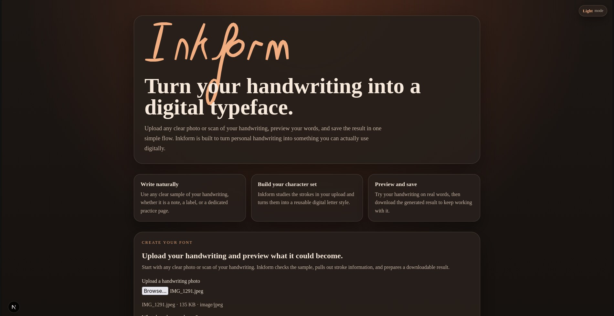
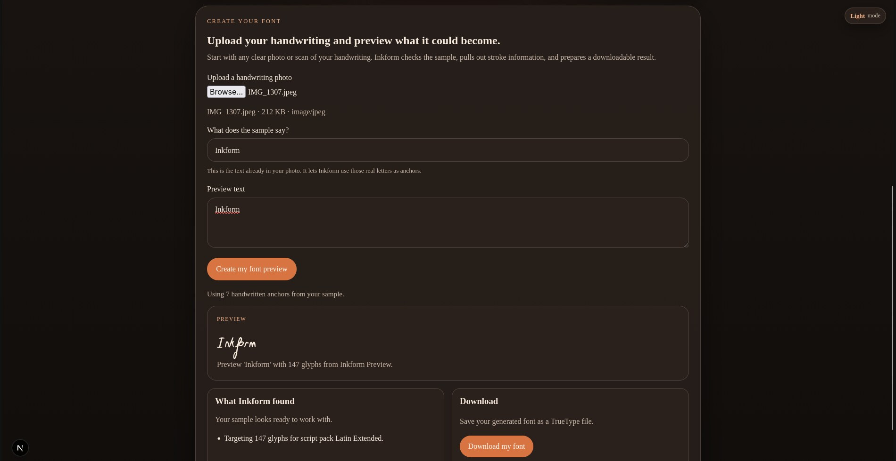

# Inkform

Inkform is a Rust-first web app that turns a freeform handwriting photo into a downloadable font. It runs its generation pipeline in the browser through WebAssembly, making it compatible with a Vercel Hobby deployment without an always-on backend.

## See It In Action





## Status

This repository contains the working hackathon build:

- Rust workspace with a core font engine and a WASM-facing wrapper crate
- Test suite for the Rust core and wrapper layers
- Clippy, formatting, and test quality gates
- Next.js frontend with upload, preview, and TrueType download flow
- Browser-compatible TTF assembly and in-browser font loading
- `AGENTS.md` as the durable project context log

## Repository Layout

- `crates/inkform-core`: deterministic Rust logic for validation, image extraction, glyph synthesis, preview, and TTF generation
- `crates/inkform-wasm`: browser-facing Rust wrapper around the core crate
- `frontend`: Next.js app intended for Vercel Hobby hosting
- `.github/workflows/ci.yml`: CI checks for formatting, clippy, and tests
- `AGENTS.md`: persistent context and decision ledger for Codex sessions

## Quality Gates

Run these before every commit:

```bash
./scripts/check.sh
```

The frontend should also be checked once dependencies are installed:

```bash
cd frontend
npm install --ignore-scripts
npm run lint
npm run typecheck
```

To build the browser WASM package:

```bash
bash scripts/build-wasm.sh
```

## Vercel Deployment

Import the repository into Vercel and set the project Root Directory to `frontend`.
`frontend/vercel.json` uses the committed browser WASM artifacts, so the Hobby
build does not need Rust or `wasm-pack`. After changing Rust code, run the WASM
build locally and commit its generated delivery artifacts; CI verifies they are current.

## Hackathon Notes

- Primary track: `Apps for Your Life`
- Current guaranteed language coverage: Latin extended
- Future non-Latin expansion will use script packs rather than claiming full Unicode support up front
- Keep the majority of build work in one Codex thread so the `/feedback` session ID remains submission-ready

## Codex Collaboration

Codex and GPT-5.6 supported the project from architecture through release verification:

- planned the Rust core, WASM wrapper, and Vercel-compatible browser execution model
- implemented and iterated on handwriting extraction, glyph grammar, TTF assembly, and font metrics
- diagnosed browser font loading and added regression tests for `cmap` compatibility and glyph topology
- ran formatting, Clippy, Rust tests, frontend lint, and TypeScript checks as part of each release pass
- converted feedback from real handwriting samples into shared generator improvements instead of hand-editing generated font files
